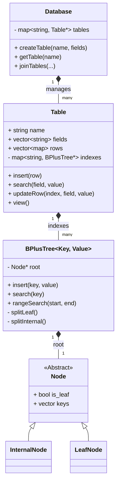
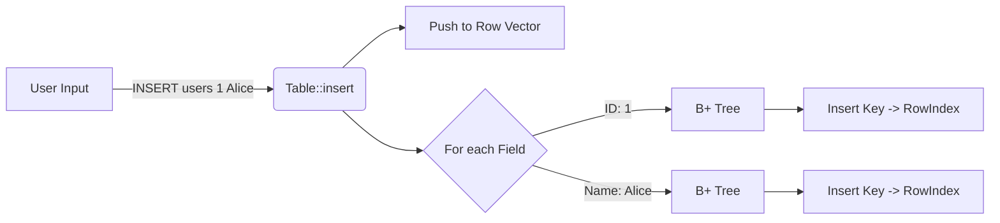
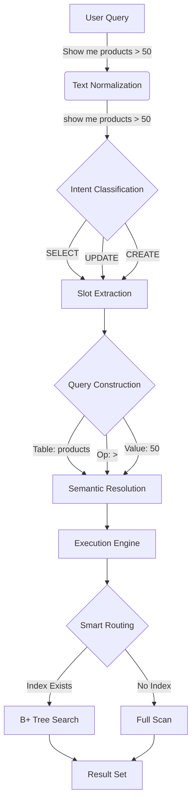
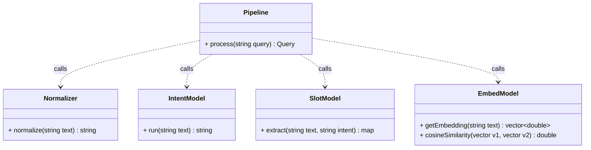
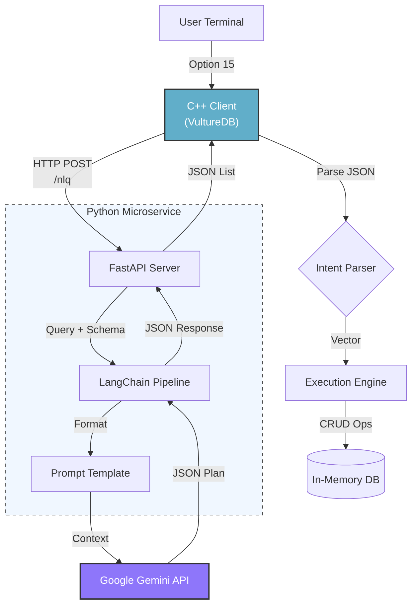

# VultureDB 🦅

> A lightweight, modular, in-memory Database Engine written in C++ from scratch, powered by B+ Tree indexing.

VultureDB is a terminal-based relational database engine that demonstrates core database internals. It features a custom **B+ Tree implementation** for $O(\log N)$ searches, dynamic schema management, efficient table joins, and file persistence.

## 🏗️ Architecture

VultureDB allows users to create tables with arbitrary fields at runtime. Every field in a table is automatically indexed using a B+ Tree, enabling fast lookups and range queries.

### Class Structure



### Data Flow: Insertion

When a record is inserted, it is stored in the linear storage (Row Vector) and indexed in **all** B+ Trees corresponding to its fields.



---

## 🧠 ML-Architected NLQ Pipeline

VultureDB integrates a sophisticated **Natural Language Query (NLQ)** engine. It uses a **7-Phase ML Pipeline** simulated with advanced heuristics (and ready for ONNX integration).



### ML System Class Diagram



### Features
- **Intent Recognition**: Detects `SELECT`, `UPDATE`, `CREATE`, `INSERT`, `JOIN`.
- **Entity Extraction (NER)**: Identifies Tables, Fields, Values, Times (`last week`).
- **Smart Execution**: Automatically routes queries to optimal B+ Tree indexes.
- **Native ML**: Built-in Linear Regression and K-Means Clustering for data analysis.

---

---

## 🤖 Generative AI Integration (Gemini + LangChain)

VultureDB now supports a state-of-the-art **Generative AI NLQ** mode (Option 15). This hybrid architecture combines the speed of C++ with the reasoning capabilities of Large Language Models.

### Architecture Flow

1.  **C++ Client**: Captures natural language input and serializes the current database schema.
2.  **Python Microservice**: A FastAPI server hosting a LangChain pipeline.
3.  **Prompt Engineering**: Dynamically constructs a prompt with schema context and strict JSON output rules.
4.  **Google Gemini**: The LLM interprets the query (converting complex compound instructions like "Create X then Insert Y" into sequential plans).
5.  **Execution**: The C++ engine parses the returned JSON plan and executes the database operations.



## 🚀 Core Features

- **Generic B+ Tree Indexing**: Custom template-based B+ Tree (`BPlusTree<K, V>`) supporting order-agnostic splitting and merging.
- **Dynamic Schemas**: Define table fields at runtime (e.g., `CREATE TABLE users id name age`).
- **Full Indexing**: **Every** column is indexed, allowing fast search on any field.
- **Efficient JOINs**: nested-loop join optimized with `O(log N)` B+ Tree lookups.
- **Persistence**: Save and Load entire database states to disk (custom text format).
- **Interactive CLI**: Easy-to-use menu system.

---

## 📂 Project Structure

```
VultureDB/
├── include/           # Header files
│   ├── bptree.hpp     # B+ Tree Template Implementation
│   ├── database.hpp   # Database Management
│   ├── table.hpp      # Table Logic
│   ├── nlq_ml/        # ML Pipeline Headers
│   └── ...
├── src/               # Source files
│   ├── main.cpp       # CLI Entry Point
│   ├── nlq_ml/        # ML Pipeline Implementation
│   │   ├── intent.cpp # Intent Classification
│   │   ├── slots.cpp  # Slot Extraction
│   │   └── pipeline.cpp
│   └── ...
├── models/            # ML Training Infrastructure
│   ├── train_intent.py
│   └── data/
├── testers/           # Python Verification Scripts
│   ├── test_engine.py
│   └── test_nlq_update.py
└── CMakeLists.txt     # Build Configuration
```

---

## 🛠️ Build & Run

### Prerequisites
- C++17 Compiler
- CMake 3.10+

### Compilation (CMake)
```bash
mkdir -p build && cd build
cmake ..
make
```

### Usage
Run the engine:
```bash
./vulturedb
```
Select **Option 14** for NLQ to talk to your database!

---

## 🧪 Testing

Run the included verification scripts to ensure everything is working:

```bash
# Verify the Core Engine
python3 testers/test_engine.py

# Verify NLQ & Update Logic
python3 testers/test_nlq_update.py
```
